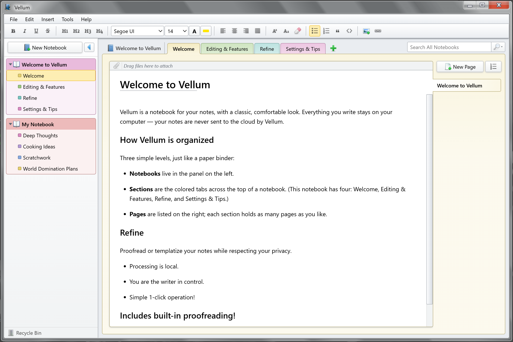

# Vellum

**A calm, local-first desktop notebook for Windows.** Vellum keeps your notes in
familiar notebooks, sections, and pages, with a comfortable classic-desktop look —
and everything stays on your own computer.



> Vellum's visual design is inspired by late-2000s desktop note-taking software.
> It is an independent project and is **not affiliated with, endorsed by, or
> sponsored by Microsoft**. See the [Disclaimer](#disclaimer).

## Why Vellum

- **Local-first and private.** Your notes live in plain files on your machine.
  Vellum never sends them to the cloud.
- **Familiar and organized.** A three-level Notebook → Section → Page structure
  that works like a paper binder.
- **Comfortable to write in.** A full rich-text editor with built-in
  proofreading and automatic saving.
- **Quietly capable.** Optional on-device text refinement — no accounts, no
  network calls.

## Features

### Organize

Notebooks, sections, and pages with color coding, drag-to-reorder, and a Recycle
Bin that makes deletion recoverable. Page templates help you start new pages
consistently.

### Write

A full rich-text editor: headings, bold / italic / underline / strikethrough,
bullet and numbered lists, blockquotes, code blocks, tables, inline images
(paste, drag-and-drop, and resize), hyperlinks, font and size, text and highlight
color, alignment, and superscript / subscript. Your work saves automatically and
recovers after a crash — there's no Save button to remember.

### Proof

Real-time spelling and grammar checking underlines issues as you type, with
one-click suggestions, a custom dictionary, and reversible "ignore" choices.
(English in this release.)

### Refine *(optional)*

Transform selected text — proofread, reformat, or apply a template — using a
model that runs entirely on your own computer. It's off by default, makes no
network calls, and is presented as an editing tool, not a chatbot.

### Find

Search across all your notebooks at once, narrow the scope to a single section or
notebook, and use in-page find to jump around long pages.

### Keep & share

Attach files to any page, export a page to Markdown, and print clean copies.

## Install

Vellum targets **Windows 10 and 11**.

1. Download the latest installer from the
   [Releases](https://github.com/ldinino/Vellum/releases) page.
2. Run it. Vellum installs per-user — no administrator rights required.

Vellum isn't code-signed, so Windows SmartScreen may show a "Windows
protected your PC" warning on first run. Choose **More info → Run anyway** to
continue. After that, Vellum checks for updates automatically and installs them
in place, prompting you to restart when one is ready.

Your notes are stored under `Documents\Vellum`.

## Building from source

Prerequisites: Node.js 20+, the Rust toolchain (stable, MSVC on Windows), and the
WebView2 runtime.

```sh
npm install          # install dependencies
npm run tauri dev    # run the app in development
npm run tauri build  # production build + installer
```

Architecture and implementation notes live in [CLAUDE.md](CLAUDE.md), and the
full product specification in [docs/Vellum_spec.md](docs/Vellum_spec.md).

## License

Vellum is released under the [MIT License](LICENSE). It also includes third-party
assets and software under their own licenses — see
[THIRD-PARTY-NOTICES.md](THIRD-PARTY-NOTICES.md). Release history is in
[CHANGELOG.md](CHANGELOG.md).

## Disclaimer

Vellum is an independent project and is not affiliated with, endorsed by, or
sponsored by Microsoft Corporation. "OneNote", "Windows", "Office", "OneDrive",
and "Segoe UI" are trademarks of Microsoft Corporation. Vellum's appearance is
inspired by, but not derived from, Microsoft software.
